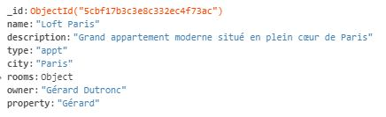
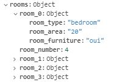

# Data science challenge : Predict building attendance

This project has been developped for a Data Science challenge at ENGIE.

# Challenge : 
Predict the attendance of T1 Tower one week in advance.
Knowledge of the building usage is a crucial element in the new dynamics of property management and could allow progress on topics such as: space optimization, security, elevator maintenance...


## Table des matières
1. [Let's begin](#lets-begin)  
    1.1 [Prerequisites](#prerequisites)  
    1.2 [Run](#run)  
2. [Technologies used](#technologies-used)    
    2.1 [List of technologies](#list-of-technologies)   
    2.2 [Architecture base de données MongoDB](#architecture-base-de-données-mongodb)   
3. [Algorithm](#algorithm)  
    3.1 [Prophet presentation](#prophet-presentation)     
    3.2 [Data preprocessing](#data-preprocessing)  
    3.3 [Page d'accueil](#page-daccueil)    
    3.4 [Page d'ajout d'un bien immobilier](#page-dajout-dun-bien-immobilier)   
    3.5 [Page de modification d'un bien immobilier](#page-de-modification-dun-bien-immobilier)  
    3.6 [Page de modification du profil](#page-de-modification-du-profil)   

## Let's begin 

Follow these instructions in order to get the project to work on your computer.

### Prerequisites

First of all, you will need to install Python and Jupyter Notebook on your machine.
You will also need to download and install the packages mentioned below with the associated command lines :

```bash
$ pip install pandas
$ pip install numpy
$ pip install pystan
$ pip install plotly
$ pip install fbprophet
```
Note that we need to install pystan and plotly because fbprophet is using these two libraries.


### Run 

1) Go to the jupyter notebook file named "Predict_building_attendance_final" and open it
2) Select "Cell" tab and then "Run all"
3) The algorithm will run and create the result file named "final_result.csv"

## Technologies used

### List of technologies

* [Python](https://www.python.org/) - Langage utilisé
* [Prophet](https://facebook.github.io/prophet/) - Open sourced machine learning algorithm created by Facebook

### Architecture base de données MongoDB

La base de données est composée de trois collections : users, biens_immobiliers et enfin room_number

La première collection sert à stocker les différents utilisateurs de l'application à l'aide de leur nom de compte et de leur mot de passe. A noter que la fonctionnalité [Modification du profil](#page-de-modification-du-profil) permet d'ajouter des informations à cet utilisateur telles que son nom, son prénom, ou encore sa date de naissance.

La deuxième collection sert à stocker les différents biens immobiliers présents dans l'application. Celle-ci est composée ainsi : 
- name : le nom du bien immobilier
- description : la description du bien immobilier
- type : le type de bien immobilier (maison, appartement, villa)
- city : la ville dans laquelle se situe le bien immobilier
- rooms : les pièces et leurs différentes caractéristiques (détaillées plus bas)
- owner : le propriétaire du bien immobilier
- property : l'utilisateur ayant ajouté le bien immobilier sur la plateforme



La partie comportant les pièces d'un bien est composée ainsi où où chaque pièce est composée de 3 variables :
- room_type : le type de pièce (WC, bedroom, bathroom, garden...)
- room_area : la surface de la pièce (en mètres carrés)
- room_furniture : la pièce est meublée (oui ou non)



## Algorithm

### Prophet presentation
Prophet is a procedure for forecasting time series data based on an additive model where non-linear trends are fit with yearly, weekly, and daily seasonality, plus holiday effects. It works best with time series that have strong seasonal effects and several seasons of historical data. Prophet is robust to missing data and shifts in the trend, and typically handles outliers well.

Prophet is open source software released by Facebook’s Core Data Science team. It is available for download on CRAN and PyPI.


### Data preprocessing
The data has been preprocessed with the following steps:
1) Train/Test datasets imports
2) date and attendance(target) variables renamed to 'ds' and 'y' to fit with Prophet's use
3) Addition of columns:
    - week : the date week number
    - on_holidays : specifies whether or not a date is part of the summer/christmas period which is considered to be from the 23rd of       December until the end of December and aswell the 3 first weeks of August
    - off_holidays : exact opposite of the on_holidays boolean variable
4) Addition of missing floors to training data : the missing floors are added based on their closeness with another not missing floor in terms of floor capacity. Exception for the T112 floor which will follow the T111 floor instead of the T104 (closest floor capacity).


### Model
The complete model takes into account one model per building floor (36 models here).
Once all the inner models and their forecast have been created, they are all joined together to form the final complete forecast which contains predictions of each building floor.


### Inner model
A unique building floor is composed of several steps which can be summarised as (* will be processed if there's a possibility to create a week based cluster model) :
1) [Merge of training and test dataframes](#trainingtest-merge)
2) Test of possible clusterisation
3) Creation of necessary columns for clusterisation*
4) Creation of Prophet model
    - Addition of saisonalities
    - Addition of cluster saisonalities*
    - Fit
    - Predict
5) Forecast cleaning
6) Cluster forecast cleaning*
7) Work periods cleaning

#### Training/Test merge
The training and test dataframes are merged because Prophet will detect the missing attendance values in the merged dataframe and forecast them

#### Test of clusterisation

### Page de modification d'un bien immobilier
Lorsque vous êtes l'utilisateur ayant ajouté le bien en question, vous pouvez cliquer sur ce bien dans la page d'accueil et arriver sur la page de modification. Au même titre que la page d'ajout, la page de modification comporte les différents champs précédement cités et permet de modifier le bien sélectionné.


### Page de modification du profil
La page de modification du profil comporte 3 champs correspondant au nom, prénom et date de naissance de l'utilisateur. Une fois ces champs remplis, vous pouvez valider afin d'ajouter/modifier ces différentes informations.
