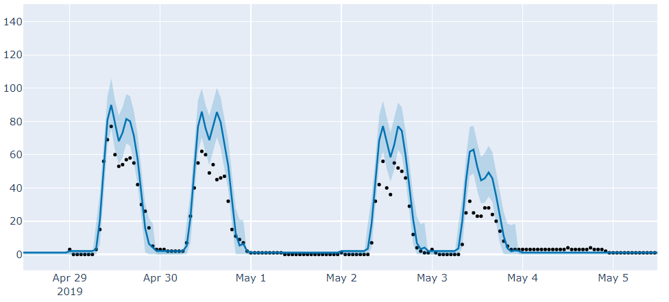

# Data science challenge : Predict building attendance

This project has been developped for a Data Science challenge at ENGIE.

# Challenge : 
Predict the attendance of T1 Tower one week in advance.
Knowledge of the building usage is a crucial element in the new dynamics of property management and could allow progress on topics such as: space optimization, security, elevator maintenance...


## Table des matières
1. [Let's begin](#lets-begin)  
    1.1 [Prerequisites](#prerequisites)  
    1.2 [Run](#run)  
2. [Technologies used](#technologies-used)    
    2.1 [List of technologies](#list-of-technologies)   
    2.2 [Prophet presentation](#prophet-presentation)  
3. [Algorithm](#algorithm)    
    3.1 [Data preprocessing](#data-preprocessing)  
    3.2 [Model](#model)    
    3.3 [Inner model](#inner-model)     
    - [Merge of training and test dataframes](#trainingtest-merge)  
    - [Test of possible clusterisation](#test-of-clusterisation)    
    - [Creation of necessary columns for clusterisation*](#creation-of-necessary-columns-for-clusterisation)    
    - [Creation of Prophet model](#creation-of-prophet-model)   
    - [Forecast cleaning](#forecast-cleaning)   
    - [Cluster forecast cleaning*](#cluster-forecast-cleaning)  
    - [Work periods cleaning](#work-periods-cleaning)   
        
        
## Let's begin 

Follow these instructions in order to get the project to work on your computer.

### Prerequisites

First of all, you will need to install Python and Jupyter Notebook on your machine.
You will also need to download and install the packages mentioned below with the associated command lines :

```bash
$ pip install pandas
$ pip install numpy
$ pip install pystan
$ pip install plotly
$ pip install fbprophet
```
Note that we need to install pystan and plotly because fbprophet is using these two libraries.


### Run 

1) Go to the jupyter notebook file named "Predict_building_attendance_final" and open it
2) Select "Cell" tab and then "Run all"
3) The algorithm will run and create the result file named "final_result.csv"

## Technologies used

### List of technologies

* [Python](https://www.python.org/) - Langage utilisé
* [Prophet](https://facebook.github.io/prophet/) - Open sourced machine learning algorithm created by Facebook

### Prophet presentation
Prophet is a procedure for forecasting time series data based on an additive model where non-linear trends are fit with yearly, weekly, and daily seasonality, plus holiday effects. It works best with time series that have strong seasonal effects and several seasons of historical data. Prophet is robust to missing data and shifts in the trend, and typically handles outliers well.

Prophet is open source software released by Facebook’s Core Data Science team. It is available for download on CRAN and PyPI.

## Algorithm

### Data preprocessing
The data has been preprocessed with the following steps:
1) Train/Test datasets imports  
2) date and attendance(target) variables renamed to 'ds' and 'y' to fit with Prophet's use  
3) Addition of columns: 
    - week : the date week number   
    - on_holidays : specifies whether or not a date is part of the summer/christmas period which is considered to be from the 23rd of       December until the end of December and aswell the 3 first weeks of August   
    - off_holidays : exact opposite of the on_holidays boolean variable 
4) Addition of missing floors to training data : the missing floors are added based on their closeness with another not missing floor in terms of floor capacity. Exception for the T112 floor which will follow the T111 floor instead of the T104 (closest floor capacity).   


### Model
The complete model takes into account one model per building floor (36 models here).
Once all the inner models and their forecast have been created, they are all joined together to form the final complete forecast which contains predictions of each building floor.


### Inner model
A unique building floor is composed of several steps which can be summarised as (* will be processed if there's a possibility to create a week based cluster model) :
1) [Merge of training and test dataframes](#trainingtest-merge) 
2) [Test of possible clusterisation](#test-of-clusterisation)   
3) [Creation of necessary columns for clusterisation*](#creation-of-necessary-columns-for-clusterisation)   
4) [Creation of Prophet model](#creation-of-prophet-model)  
    - Addition of saisonalities    
    - Addition of cluster saisonalities*     
    - Fit  
    - Predict  
5) [Forecast cleaning](#forecast-cleaning)  
6) [Cluster forecast cleaning*](#cluster-forecast-cleaning) 
7) [Work periods cleaning](#work-periods-cleaning)  
    
#### Training/Test merge
The training and test dataframes are merged because Prophet will detect the missing attendance values in the merged dataframe and forecast them

#### Test of clusterisation
Depending on the separability of the week mean attendances, this part will intent to detect them and to create week clusters in order to adapt the model for each group of "same" weeks. If the week mean attendances are not separable (close to each others), then there is no need for clusterisation and the model will not run the clusters parts (*)

#### Example of week clusters on T105


Note that this week clusterisation has a strictness parameter which can be set. Here, after a deep study of each building floor and its attendance we decided to assign specific strictness parameter to some floors. Indeed, the more irregular the floor attendance was, the stricter the parameter had to be set.
All the strictness parameters corresponding to each floors can be found in the [building_floor_study](#API_Flask/doc/building_floor_study.docx) file. 

#### Creation of necessary columns for clusterisation*
Adds cluster columns to the complete DataFrame for future model fit. The cluster columns are based on the precedent test of clusterisation which got several week attendance groups.

#### Creation of Prophet model 
The core algorithm code is located here. Indeed, this is where the Prophet algorithm is used to predict attendance values with the following steps:     
- Addition of saisonalities : Prophet handles multi-saisonalities so two distinct weekly saisonalities are created: the first one       during the "summer/christmas" period and the other one during the rest of the year  
       
- Addition of cluster saisonalities* : weekly saisonalities will also be added to the model for each existent week cluster. If a        cluster is part of a "on_holiday" saisonality, it will not be considered    
- Fit : the Prophet model is fitted on whole data   
- Predict : the Prophet model tries to forecast all the missing attendance values present in the whole data 

#### Forecast cleaning
As the model is not really efficient to predict attendance during out of office periods such as night, weekends and holiday days, this part tends to correct the forecast during these periods by replacing the forecasts by the mean of real values during equivalent periods. This part also corrects negative forecasted values and uncertainty

See below for illustration on floor T114:

#### Without forecast cleaning


#### With forecast cleaning


#### Cluster forecast cleaning*
If it has been possible to create week attendance clusters, the same [forecast cleaning](#forecast-cleaning) mentioned above is applied inside these different clusters such as the mean correction is correct during these special periods.

#### Work periods cleaning
After a deep study of the data, we observe that some building floors are composed of "work periods" (periods during which almost no one is present at this floor). 
Thus, this part intents to detect these periods and to correct the forecast by replacing by the mean of real values during equivalent periods which is based on the week mean of attendance.

See below for illustration on floor T104:

#### Without work periods cleaning


#### With work periods cleaning


##### * : Only executed if a week clusterisation is possible
